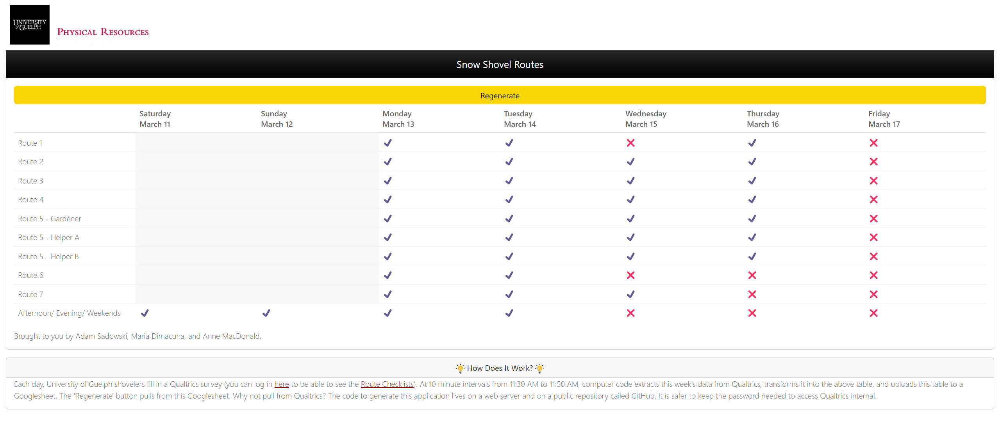

<!-- README.md is generated from README.Rmd. Please edit that file -->

```{r, include = FALSE}
knitr::opts_chunk$set(
  collapse = TRUE,
  comment = "#>",
  fig.path = "man/figures/README-",
  out.width = "100%"
)
```

# shovelApp

<!-- badges: start -->

[](https://github.com/asadow/shovelApp/actions/workflows/R-CMD-check.yaml) [](https://app.codecov.io/gh/asadow/shovelApp?branch=master) [](https://lifecycle.r-lib.org/articles/stages.html#stable)

<!-- badges: end -->

shovelApp is a Shiny application/R package for deploying a checklist table of whether University of Guelph shovel routes have been completed. The only user activity is a Regenerate button to update the table given that the sourced Googlesheet undergoes updates (mainly between 11:30 AM to 11:50 AM each day).




## Installation

You can install the development version of shovelApp like so:

``` r
install_github("asadow/shovelApp")
```
